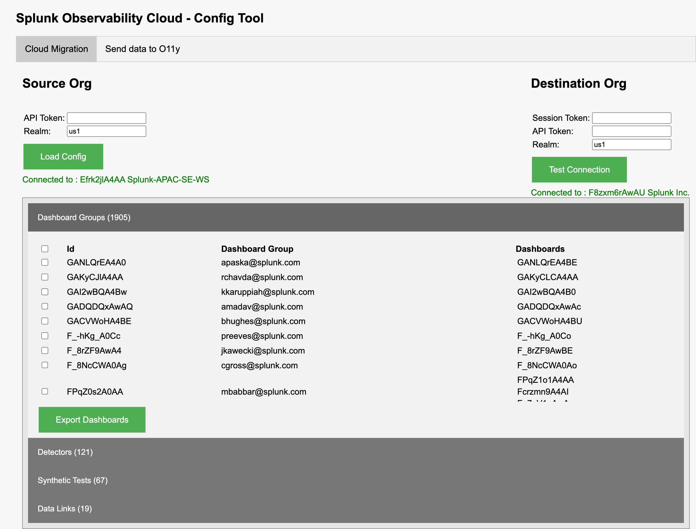
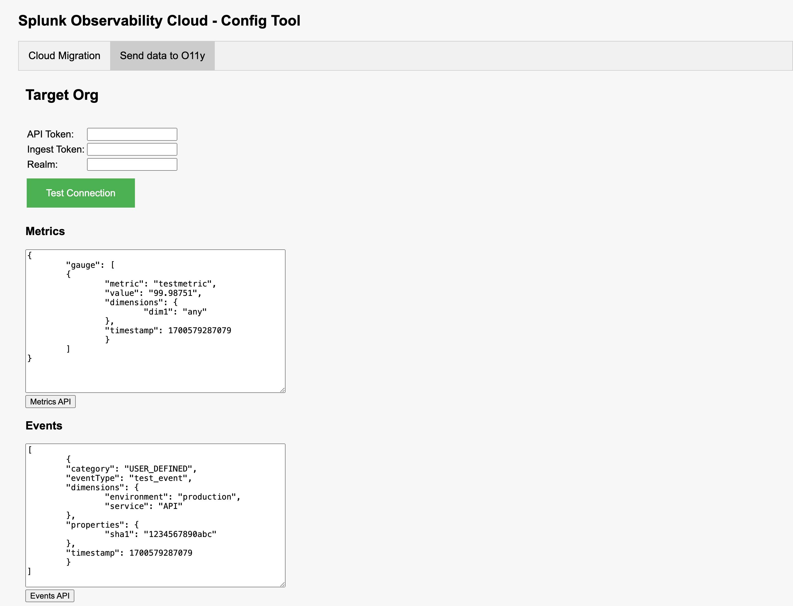

# Splunk Observability Cloud API tool  (Not supported, Internal use only)

## Config migration
 - Dashboard Groups, Detectors, Data links, Synthetic tests from one org to other

NOTE - It can be used for bulk migration by doing a select all on object, but **DO NOT RUN SELECT ALL as still under dev**
NOTE - It'll have few minor bugs

### Start App (if not hosted)

```
flask run
```
Link -  127:0.01:5000



## Test Metric and Events API

Allows users to test the payload for creating metrics and events




